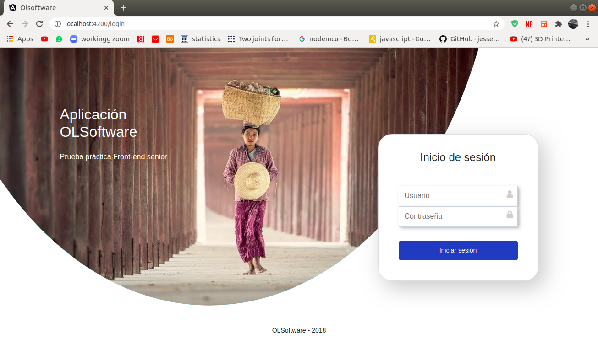
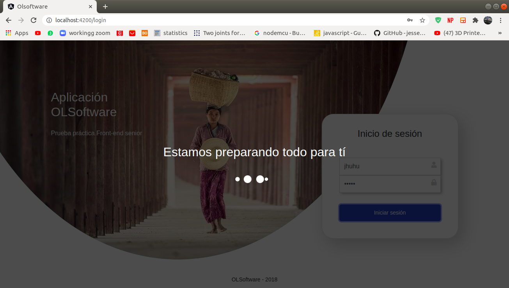
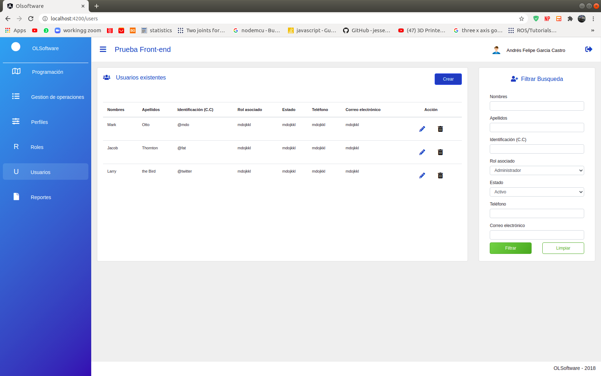
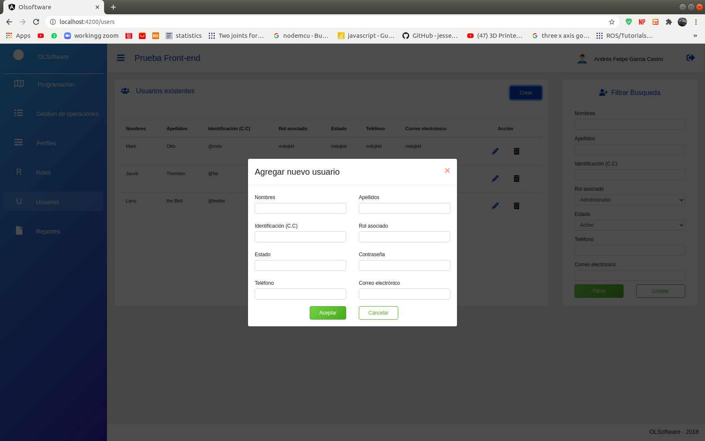

# OLSoftware

Este proyecto está hecho con [Angular CLI](https://github.com/angular/angular-cli) version 10.0.2.

## Vista principal login


## Librerias Usadas
1. Bootstrap, (CDN), version: 4.5.2
2. fontawesome, (CDN), version: 5.13

## Para iniciar
1. Recuerda ejecutar
    ```
    npm install
    ```
2. Ejecuta y monitorea los cambios en el servidor de desarollo
    ```
    ng serve
    ```
3. Navega a `http://localhost:4200/`.

4. Para correr las pruebas de desarrollo vía [Karma](https://karma-runner.github.io).
    ```
    ng test
    ```
5. Para correr pruebas end-to-end vía [Protractor](http://www.protractortest.org/).
    ```
    ng e2e
    ```

## Consejos
1. Para ver loading debe escribir cualquier cosa en los inputs usuario y contraseña, posteriormente dar click en el boton de iniciar sesión.
2. De click en el logo de menú que se encuentra en el navbar para desplegar el sidebar.
3. De click en el boton crear para ver el modal.

## Loading

## Usuarios

## Modal
